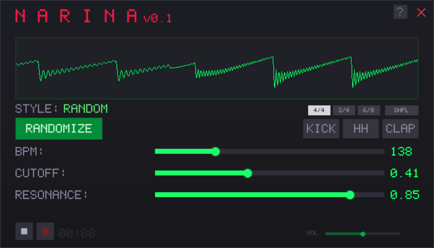

# NARINA

Portable acid techno loop generator for Windows. Single .exe, no installation.


-lightgrey)



## What it does

Generates random acid techno loops with one button press. TB-303-style sawtooth oscillator through a resonant SVF filter with envelope modulation. DSP core written in x86-64 NASM assembly.

## Download

Grab the latest release from the [Releases page](https://github.com/basilei0s/NARINA/releases).

**Windows**: Download `narina-windows.exe` and run it. SmartScreen may warn on first run — click "More info" → "Run anyway".

## Features

- **5 styles**: Dark Acid, Trance, Hardcore, Hypnotic, Hard Acid
- **10 scales**: minor pentatonic, blues, phrygian, minor, harmonic minor, dorian, chromatic, major, major pentatonic, lydian
- **29 rhythm templates** with per-step randomization
- **Percussion**: kick (sine pitch sweep), hihat (metallic oscillators + noise), clap (noise burst with flam)
- **Hihat loop generator**: rule-based closed/open patterns, regenerated on each toggle
- **Time signatures**: 4/4, 3/4, 6/8 with shuffle
- **Real-time controls**: BPM (80-300), cutoff, resonance, volume
- **Tap tempo**: click BPM label or press T
- **WAV recording** with unique filenames
- **Custom borderless UI** with bitmap font, window dragging, acid smiley icon

## Hotkeys

| Key | Action |
|-----|--------|
| Space | Play / Stop |
| Enter | Randomize |
| R | Record start / stop |
| T | Tap tempo |
| 1 | Kick toggle |
| 2 | Hihat toggle (generates new pattern) |
| 3 | Clap toggle |
| H | Help overlay |
| Esc | Close help |

## Building (Windows)

### Requirements

- [MinGW-w64](https://winlibs.com/) (GCC)
- [NASM](https://www.nasm.us/)
- [SDL2 development libraries](https://github.com/libsdl-org/SDL/releases) (mingw, extract to project root)
- [UPX](https://upx.github.io/) (optional, for compression)

### Build

```
build.bat
```

Produces `narina.exe` (~1.7 MB, ~590 KB with UPX).

### Compress (optional)

```
upx --best narina.exe
```

## macOS (experimental)

A macOS build is available as `narina-macos.dmg` on the [Releases page](https://github.com/basilei0s/NARINA/releases). SDL2 is bundled inside the app.

**Important**: macOS will show "NARINA.app is damaged and can't be opened" because the app is unsigned. To fix, open Terminal and run:

```
xattr -cr /Applications/NARINA.app
```

After that it opens normally. This is required for all unsigned macOS apps downloaded from the internet.

To build locally: `brew install sdl2` then `./build_mac.sh`. Uses C fallback for DSP (no NASM on ARM).

## Architecture

```
src/
  main.c     - SDL2 window, UI, bitmap font, input handling
  audio.c    - Pattern generation, sequencer, percussion, audio callback
  audio.h    - Shared types (DspState, Step, Pattern, Sequencer)
  dsp.asm    - NASM x86-64 DSP core (oscillator, SVF filter, envelopes)
  dsp.c      - C fallback DSP for non-x86 platforms (macOS ARM)
  narina.rc  - Windows resource file (icon)
tools/
  gen_icon.c - Generates narina.ico (acid smiley)
build.bat    - Windows build script
build_mac.sh - macOS build script
```

### DSP signal chain

```
Sawtooth osc → Frequency slide → Filter envelope → SVF filter (+ tanh saturation) → Amp envelope → Output
```

## License

[MIT](LICENSE)
